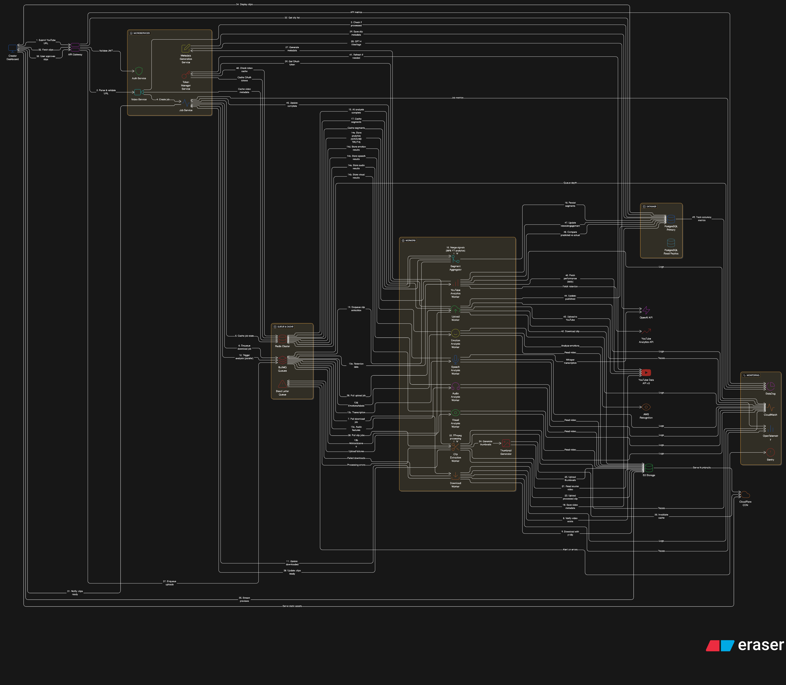

# **Shortly**

**Automated YouTube Shorts platform** — transform long-form videos into high-engagement, viral Shorts using AI-powered video, audio, and engagement analysis.

---


<p align="center">
  
</p>

---

## 🚀 What Shortly Does

* Ingests **YouTube videos**
* Detects **high-retention moments**
* Automatically generates **short clips with captions**
* Optimized for **Shorts / Reels / TikTok**
* Fully **asynchronous, scalable architecture**

---

## 🧩 Tech Stack

* **Frontend:** Next.js (App Router)
* **API:** NestJS
* **Workers:** Node.js + Python (FFmpeg, AI pipelines)
* **Queue:** Redis
* **Database:** PostgreSQL + Prisma
* **Storage:** S3-compatible (MinIO locally)
* **Infra:** Docker, Terraform, Turborepo, pnpm

---

## ⚡ Quick Start

### Prerequisites

* Node.js **20+**
* pnpm **8+**
* Docker & Docker Compose

---

### 🛠 Setup

```bash
# Install dependencies
pnpm install

# Start local infrastructure (Postgres, Redis, MinIO)
pnpm docker:up

# Initialize database
pnpm db:push
pnpm db:seed

# Build shared packages
pnpm build

# Start all services in development mode
pnpm dev
```

---

## 🧪 Common Commands

### Development

```bash
pnpm dev              # Start all apps & workers
pnpm build            # Build all apps
pnpm test             # Run tests
pnpm lint             # Lint codebase
pnpm format           # Format code
```

### Database

```bash
pnpm db:studio        # Open Prisma Studio
pnpm db:migrate       # Run migrations
pnpm db:push          # Push schema changes
```

### Infrastructure

```bash
pnpm docker:up        # Start local services
pnpm docker:down      # Stop services
pnpm docker:logs      # View logs
```

---

## 🧱 Local Services

| Service         | URL                                            |
| --------------- | ---------------------------------------------- |
| PostgreSQL      | `localhost:5432`                               |
| Redis           | `localhost:6379`                               |
| Redis Commander | [http://localhost:8081](http://localhost:8081) |
| MinIO Console   | [http://localhost:9001](http://localhost:9001) |

---

## 🗂 Project Structure

```
shortflow/
├── apps/                     # Deployable applications
│   ├── api/                  # NestJS API
│   ├── web/                  # Next.js frontend
│   └── worker-*              # Async workers (download, analysis, clips)
│
├── packages/                 # Shared internal libraries
│   ├── database/             # Prisma client & schema
│   ├── types/                # Shared TypeScript types
│   ├── logger/               # Centralized logging
│   └── config/               # ESLint / TS / Prettier configs
│
└── infrastructure/           # Infrastructure as Code
    ├── docker/               # Local Docker setup
    └── terraform/            # Cloud provisioning
```

---

## 🧠 Architecture Principles

* **Event-driven** (queue-first, not HTTP-first)
* **Workers are stateless**
* **Shared packages = primitives only**
* **AI pipelines are isolated & replaceable**
* **Designed for horizontal scaling**

---

